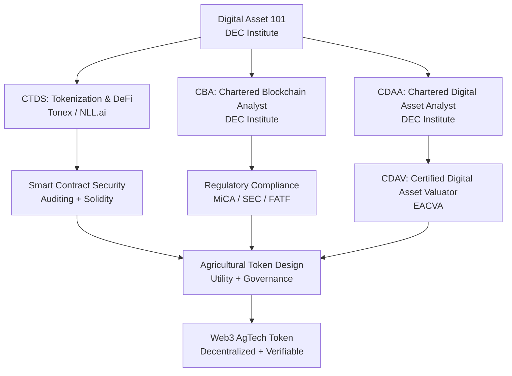

## Digital Finance & Tokenomics Roadmap

```mermaid
graph TD
    A[Digital Asset 101<br/>DEC Institute] --> B[CTDS: Tokenization & DeFi<br/>Tonex / NLL.ai]
    A --> C[CBA: Chartered Blockchain Analyst<br/>DEC Institute]
    A --> D[CDAA: Chartered Digital Asset Analyst<br/>DEC Institute]
    B --> E[Smart Contract Security<br/>Auditing + Solidity]
    C --> F[Regulatory Compliance<br/>MiCA / SEC / FATF]
    D --> G[CDAV: Certified Digital Asset Valuator<br/>EACVA]
    E --> H[Agricultural Token Design<br/>Utility + Governance]
    F --> H
    G --> H
    H --> I[Web3 AgTech Token<br/>Decentralized + Verifiable]
```
