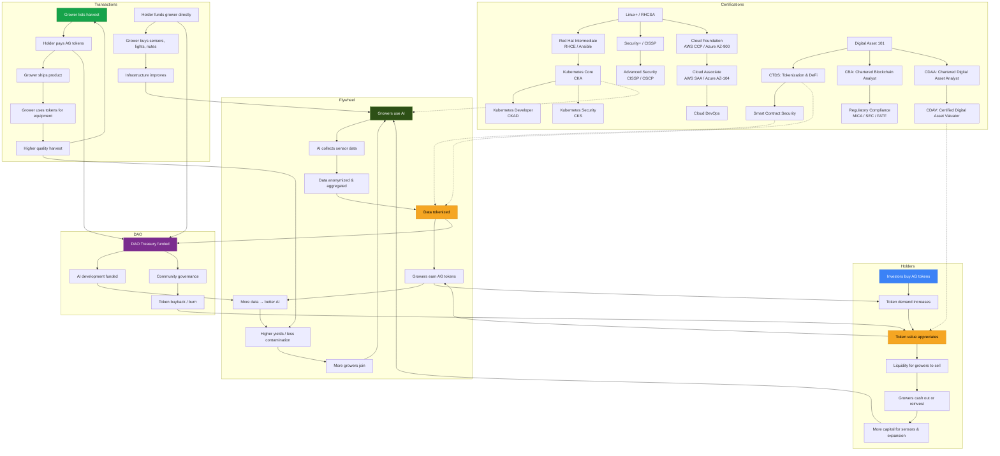

## Complete AgTech AI + Tokenomics Ecosystem

```mermaid
graph TD
    subgraph Certifications
        A[Linux+ / RHCSA] --> B[Red Hat Intermediate<br/>RHCE / Ansible]
        A --> C[Security+ / CISSP]
        A --> D[Cloud Foundation<br/>AWS CCP / Azure AZ-900]
        B --> E[Kubernetes Core<br/>CKA]
        D --> F[Cloud Associate<br/>AWS SAA / Azure AZ-104]
        E --> G[Kubernetes Developer<br/>CKAD]
        E --> H[Kubernetes Security<br/>CKS]
        F --> I[Cloud DevOps]
        C --> J[Advanced Security<br/>CISSP / OSCP]
        K[Digital Asset 101] --> L[CTDS: Tokenization & DeFi]
        K --> M[CBA: Chartered Blockchain Analyst]
        K --> N[CDAA: Chartered Digital Asset Analyst]
        L --> O[Smart Contract Security]
        M --> P[Regulatory Compliance<br/>MiCA / SEC / FATF]
        N --> Q[CDAV: Certified Digital Asset Valuator]
    end
    subgraph Flywheel
        R[Growers use AI] --> S[AI collects sensor data]
        S --> T[Data anonymized & aggregated]
        T --> U[Data tokenized]
        U --> V[Growers earn AG tokens]
        V --> W[More data → better AI]
        W --> X[Higher yields / less contamination]
        X --> Y[More growers join]
        Y --> R
    end
    subgraph Holders
        Z[Investors buy AG tokens] --> AA[Token demand increases]
        AA --> AB[Token value appreciates]
        AB --> AC[Liquidity for growers to sell]
        AC --> AD[Growers cash out or reinvest]
        AD --> AE[More capital for sensors & expansion]
        AE --> R
    end
    subgraph Transactions
        AF[Grower lists harvest] --> AG[Holder pays AG tokens]
        AG --> AH[Grower ships product]
        AH --> AI[Grower uses tokens for equipment]
        AI --> AJ[Higher quality harvest]
        AJ --> AF
        AK[Holder funds grower directly] --> AL[Grower buys sensors, lights, nutes]
        AL --> AM[Infrastructure improves]
        AM --> R
    end
    subgraph DAO
        U --> AN[DAO Treasury funded]
        AG --> AN
        AK --> AN
        AN --> AO[AI development funded]
        AO --> W
        AN --> AP[Community governance]
        AP --> AQ[Token buyback / burn]
        AQ --> AB
    end
    E -.-> R
    L -.-> U
    O -.-> U
    Q -.-> AB
    V --> AA
    AB --> V
    AJ --> X
    style R fill:#2d5016,stroke:#4a7c24,color:#fff
    style U fill:#f5a623,stroke:#d48c1a,color:#000
    style Z fill:#3b82f6,stroke:#2563eb,color:#fff
    style AF fill:#16a34a,stroke:#1e7e34,color:#fff
    style AN fill:#7b2d8e,stroke:#9b4dae,color:#fff
    style AB fill:#f5a623,stroke:#d48c1a,color:#000
```
